# 📱 Modul Praktikum 4: Core Components & Styling #

## 🎯 Tujuan Pembelajaran

Setelah menyelesaikan praktikum ini, mahasiswa mampu:

1. Memahami dan menggunakan **16 Core Components** React Native
2. Menerapkan **StyleSheet** untuk styling terpusat
3. Menggunakan **useState** untuk state management dasar
4. Membuat layout yang responsif dengan **Flexbox**
5. Menangani **interaksi pengguna** (tekan, input, scroll)

## 📲 Praktikum ##

### Langkah 1: Import Library & Components ###

1. Buka File App.js pada folder proyek ptm2
2. Import Library dan Core Component yang dibutuhkan
3. Konfirmasi bukti
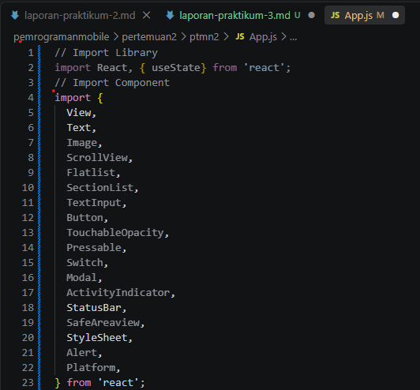

### Langkah 2: Menyiapkan Array Objek untuk menampung data ###

1. Membuat Array Objek bernama Profile untuk menampung data Profile
2. Konfirmasi bukti
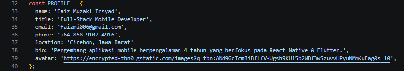
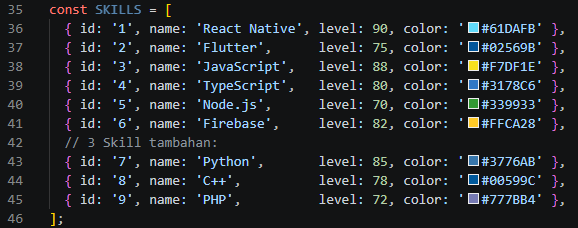
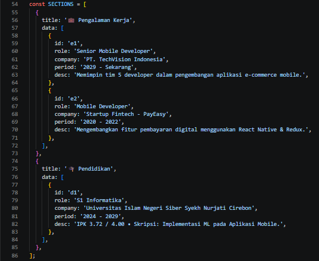

### Langkah 3: Sub-Components (SkillCard & TimelineCard) ###
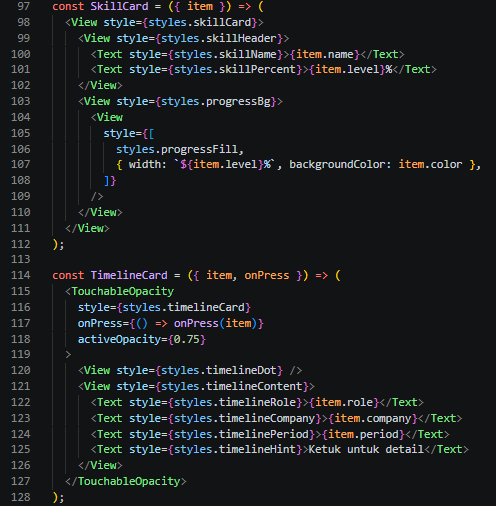

### Langkah 4: State Management dengan useState ###
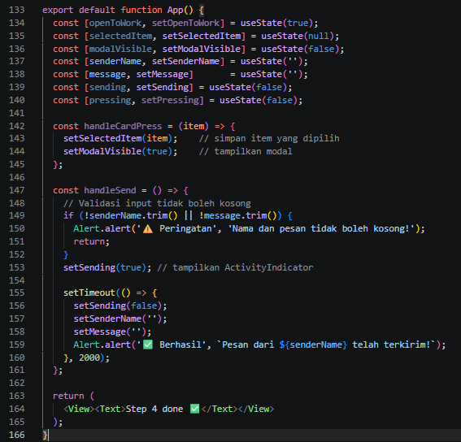

### Langkah 5: SafeAreaView, StatusBar & Header ###
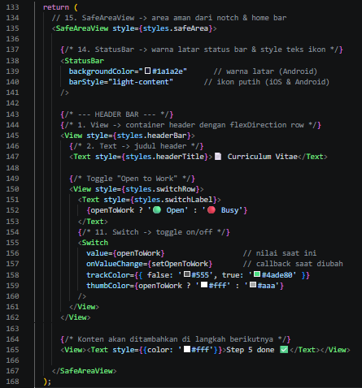

### Langkah 6: ScrollView & Profil Section (View, Text,  img/image) ###
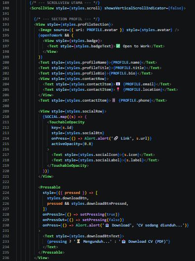

### Langkah 7: FlatList (Daftar Skills) ###
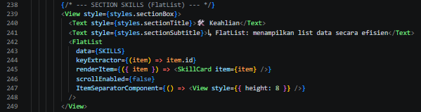

### Langkah 8: SectionList (Pengalaman & Pendidikan) ###
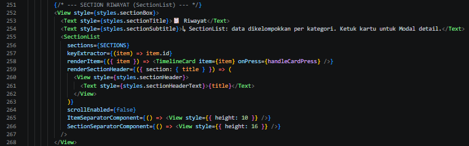

### Langkah 9: TextInput, Button & ActivityIndicator ###
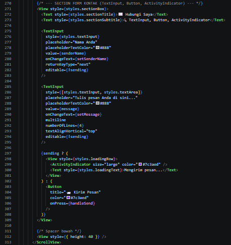

### Langkah 10: Modal (Popup Detail) ###
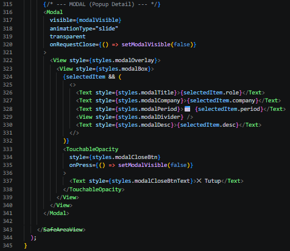

### Langkah 11: StyleSheet (Styling Terpusat) ###
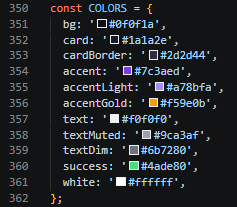
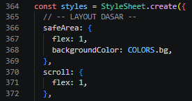
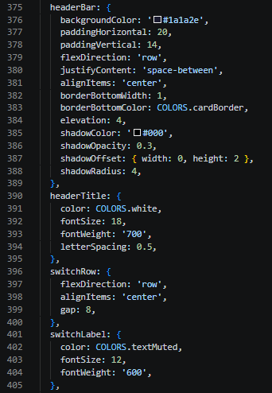
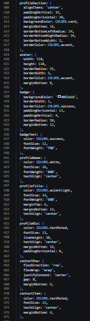
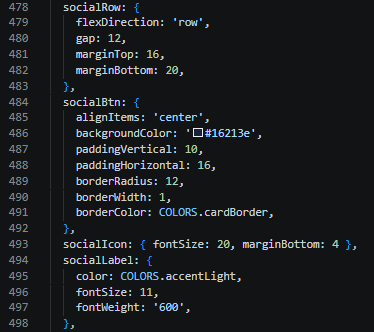
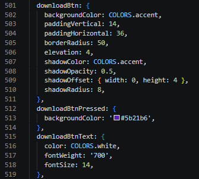
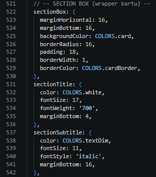
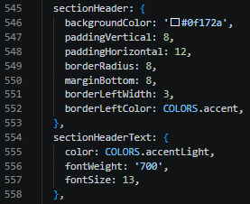
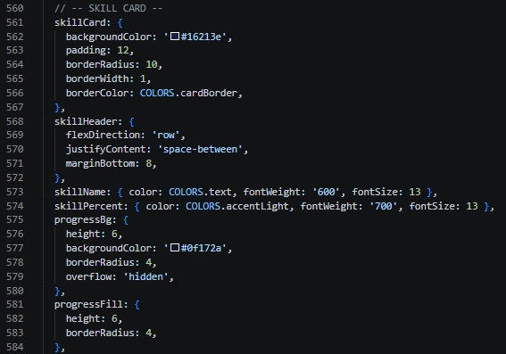
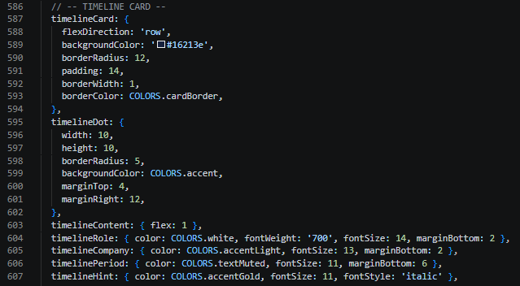
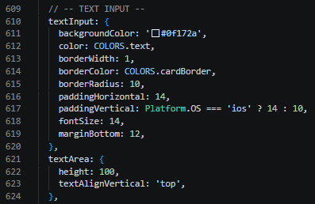
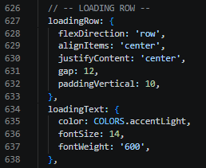
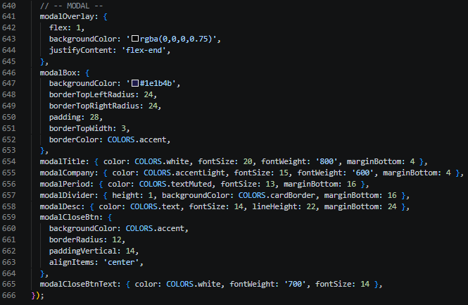

### Langkah 12: Verifikasi & Pengujian ###
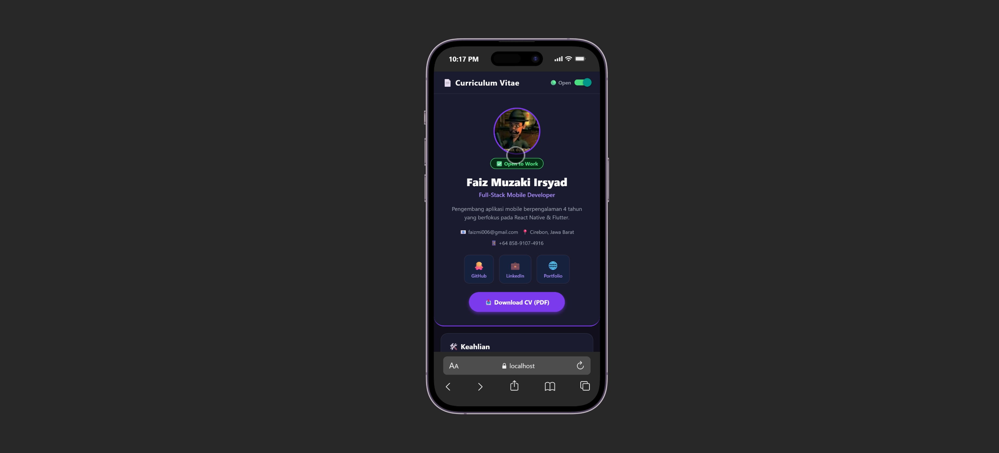

### Hasil Akhir ###
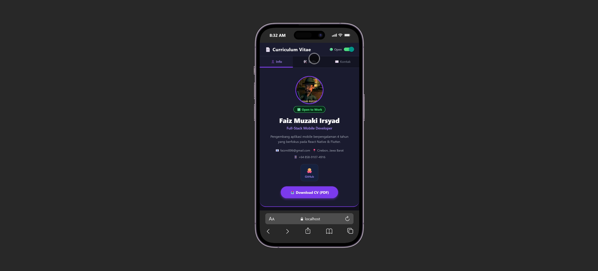
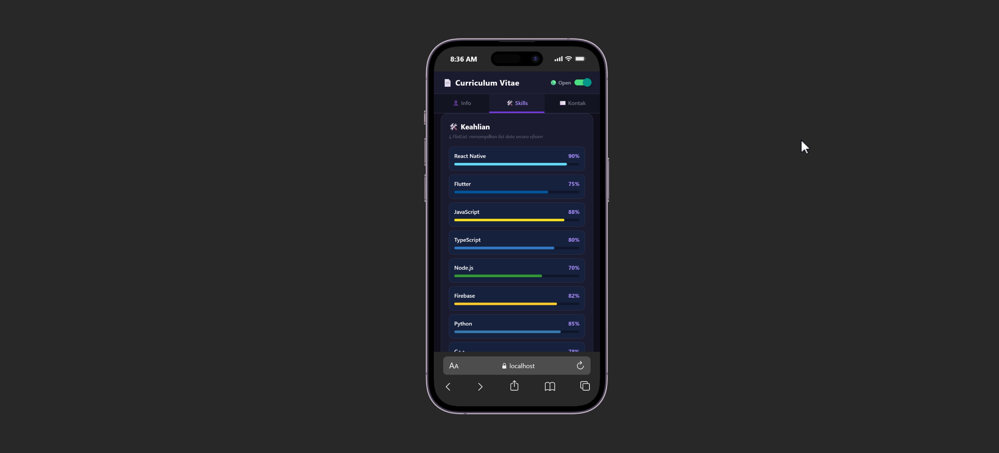
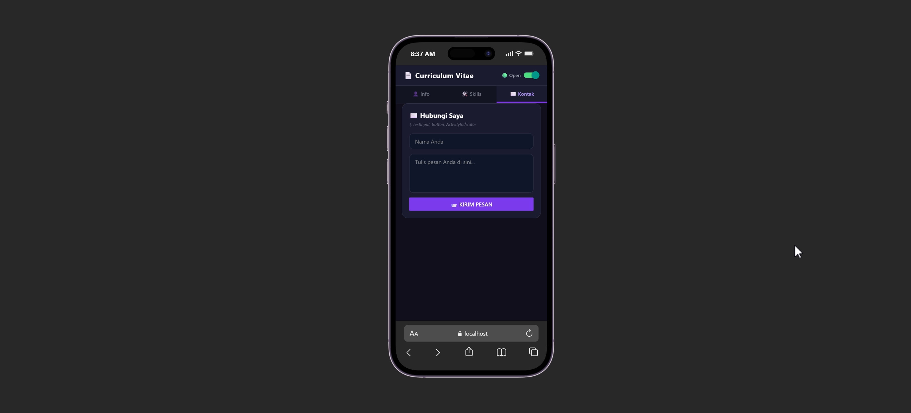
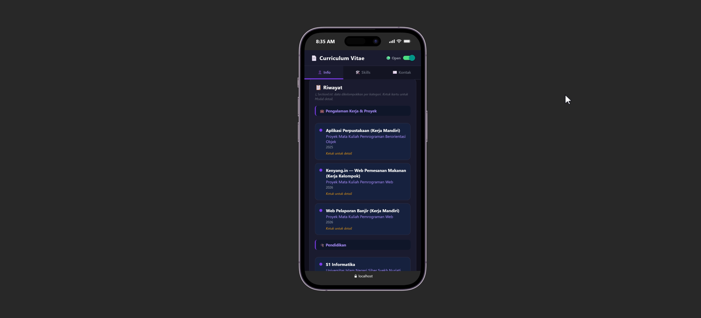
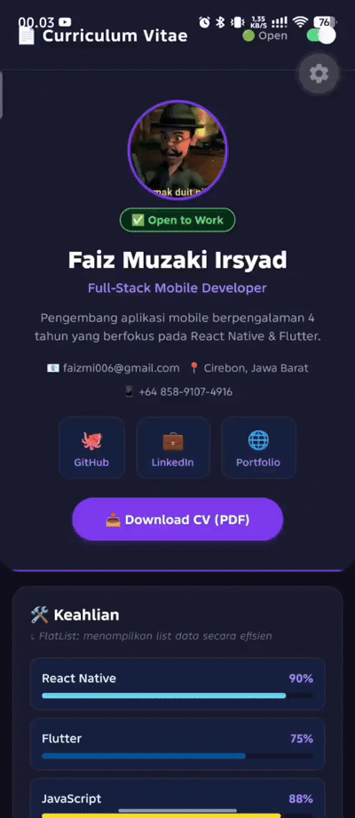